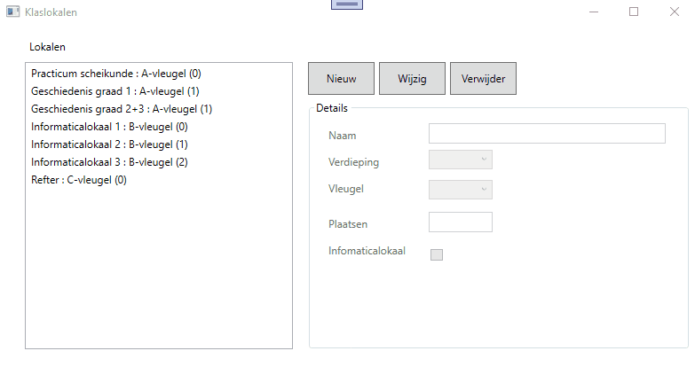

# Oefening klassen en eigenschappen : klaslokalen

In de starterscode vind je de nodige controls en eventhandlers terug in je venster.  
Je maakt zelf een class library aan (met de correcte naam) en je zorgt zelf voor de nodige referenties.  

Je programma dient een lijst bij te houden met verschillende klaslokalen binnen een school.    

Van elk klas houden we volgende bij :  
  * naam, string, indien leeg vervangen door "nog toe te kennen naam"
  * verdieping, sbyte, waarde ligt tussen -1 en 2, indien andere waarde automatisch laten vullen met 0
  * vleugel, char, enkel de waarden 'A', 'B', 'C', 'D' en '?' zijn toegelaten.  Indien andere, automatisch vullen met '?'
  * bezetting (= max aantal personen in de klas), int, indien waarde < 1, automatisch vullen met 1, indien waarde > 250, automatisch vullen met 250
  * computerlokaal, bool

Je moet in staat zijn om nieuwe klassen toe te voegen, te wijzigen of te verwijderen.  

Succes!
